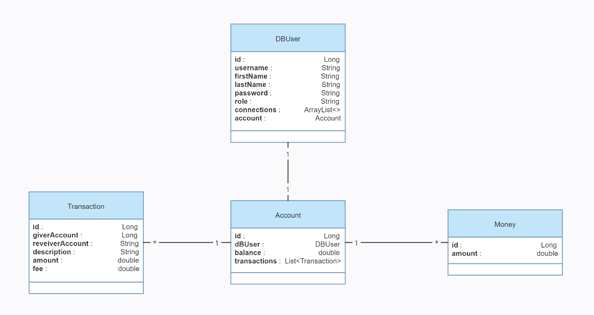
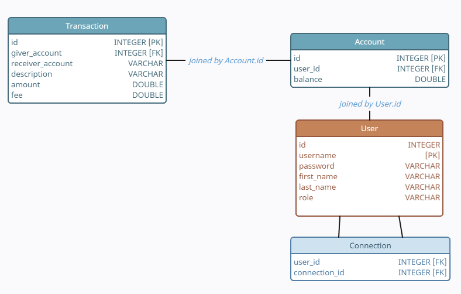

<h1>Pay My Buddy</h1>

<em>Open Classrooms Project 6 - "Concevez une application web Java de A à Z"</em>

This project is a Spring Boot Application focusing on back-end, database and a frontend view with Thymeleaf. This is a prototype of an application making money transfer easy between friends.

<a href="database_script.sql">Script.sql</a>

Once the database created and the application launched, you should be able to access the application at http://localhost:8080 and create a new account to navigate or use the following default account : 
username : johndoe@email.com 
password : user

<h2>UML diagram</h2>

<h2>Physical data model</h2>
